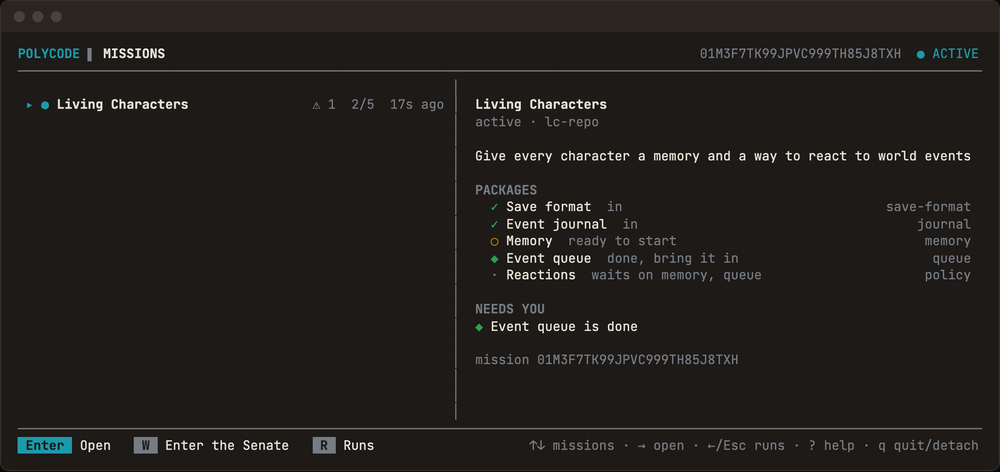
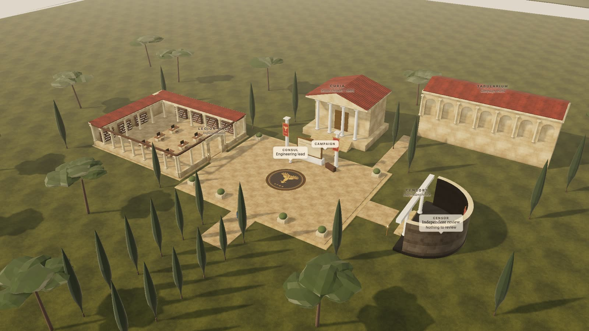
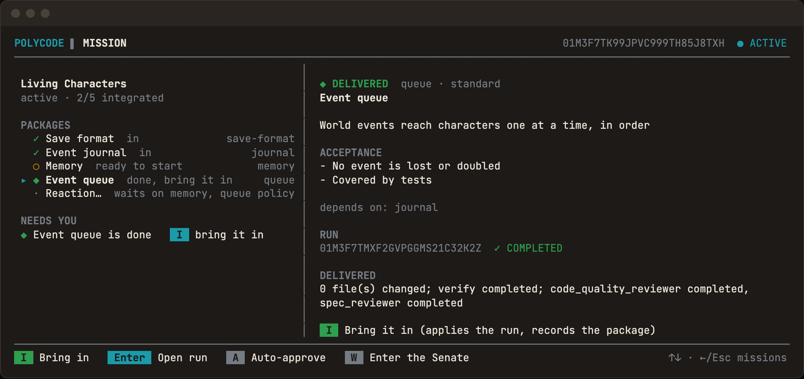
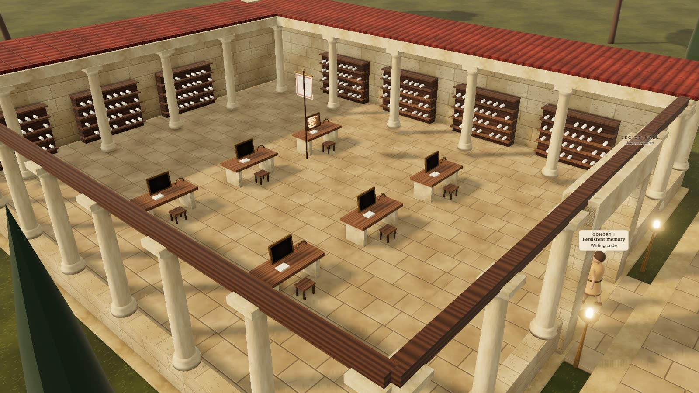
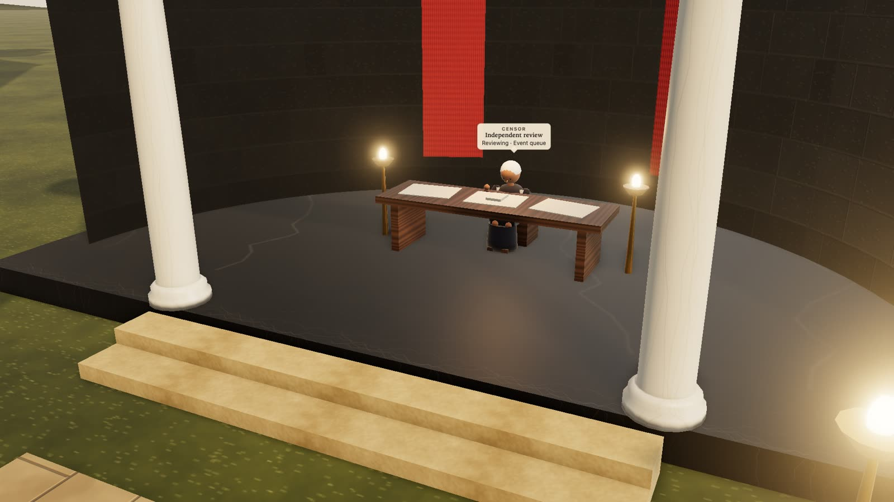

# The Senate

**Put someone in charge of your coding agents.**

<p align="center">
  
  <br />
  <em>The same run, watched two ways: a terminal control room, and — if you open it — a small Roman campus in your browser.</em>
</p>

Most tools give you more AI coders. The Senate gives them someone to answer to.

You talk to one lead. It splits the work into pieces, hands each one to a worker in its own git worktree, has an independent reviewer check the result, runs your repository's own checks, and brings you only what's ready to say yes or no to. Nothing reaches your checkout without your explicit approval.

The command is still `polycode`.

## What it does, in three lines

- You describe a piece of work to the **Consul**, the one lead you talk to.
- The Consul splits it into **Orders**, each one done by a **Cohort** — Claude Code or Codex, in its own git worktree — and checked by an independent **Censor** plus your repository's own checks.
- Nothing lands in your checkout, and nothing gets pushed, until you say so.

## Install

macOS (Apple Silicon and Intel) and Linux x86_64. Windows is not supported — the Senate needs tmux. Linux ARM has no official build yet.

```bash
curl -fsSL https://raw.githubusercontent.com/escapemanuele/polycode/main/install.sh | sh

polycode --version
polycode doctor
```

The installer downloads an official release binary, verifies its SHA-256 against the release's own `SHA256SUMS`, confirms the binary reports the version the release claims, and installs it into `~/.local/bin/polycode`. It never uses `sudo`, never writes outside that directory and the Senate's own data directory, and never edits your shell configuration — if `~/.local/bin` is not on `PATH` it prints the line to add.

```bash
POLYCODE_VERSION=0.1.1 sh install.sh      # install a specific release
POLYCODE_INSTALL_DIR=~/bin sh install.sh  # install somewhere else
POLYCODE_FORCE=1 sh install.sh            # replace a file the Senate does not manage
```

`polycode doctor` reports the install source; a bootstrap installation reads `install source: official binary` and `automatic update: supported`. See [Updates](#updates) below for how self-update works and how to turn it off.

This is early-stage software. Validated state, restart-safe SQLite persistence, DAG scheduling, and crash-recoverable tmux supervision are in place. Gemini, custom routing, a daemon mode, and direct provider chat are not built yet — see [Architecture](#architecture-and-status).

## How it works

1. You give the Consul a goal — from the CLI or the TUI.
2. The Consul turns it into a plan of **Orders**, each with its own scope, acceptance criteria, and dependencies on other Orders.
3. Each Order runs as a **Cohort** — the Claude Code or Codex CLI, using your own existing login — in its own disposable git worktree. It never touches your checkout directly.
4. An independent **Censor** reviews what the Cohort delivered, separately from the worker who built it.
5. Your repository's own checks run (`cargo test`, `npm test`, whatever `[verify]` names) — no agent involved.
6. You look at the diff and the verdicts, and decide: apply it to your checkout, open a pull request, ask for another pass, or throw it away.

Closing the terminal never discards work in progress: a Cohort keeps running under tmux until you resume and explicitly apply or discard it.

## Two surfaces, one state

| Command (terminal) | Presence (3D) |
|---|---|
|  |  |

**The control room** (`polycode` or `polycode tui`) is the real interface: a Ratatui terminal screen that lists runs, shows every stage, previews diffs, and is where you actually resume, retry, apply, or discard.

**The Senate** (`polycode world`, or `W` in the TUI) is optional: a local 3D view that opens in your browser and shows the same state as a small Roman campus — Cohorts walking to their desks when an Order starts, the Censor's chamber lighting up during review, a Cohort raising a red flag when an Order needs you. It reads state fresh on every request; it is never the source of truth, and closing the browser tab stops nothing. It runs on `127.0.0.1` only, checked with a random token and a `Host`-header guard, and never leaves your machine.

<p align="center">
  
  
</p>

```bash
polycode world                        # open (or reuse) the local 3D view
polycode world --mission <mission-id> # bind it to one campaign
polycode world --no-open              # just print the URL
```

## Names, in plain words

| Term | Plain meaning |
|---|---|
| **Consul** | The one lead you talk to. Splits your goal into a plan and answers your questions about it. |
| **Order** | One piece of the job — a work package with its own scope, acceptance criteria, and dependencies. |
| **Cohort** | The worker that does an Order: the Claude Code or Codex CLI, in its own git worktree. |
| **Censor** | The independent reviewer that checks a Cohort's delivered work before it's offered to you. |

(These map onto `Mission`, `Work package`, and the run's providers/reviewers in the code and docs — see `CONTEXT.md` for the full vocabulary.)

## Missions: the plan above the work

A mission is the project goal above any one run: a plan of Orders with dependencies, the decisions it rests on, and the runs that deliver each one. The Senate owns the coordination you'd otherwise do by hand — a Cohort's handoff is rendered from mission state, an Order's status follows committed evidence from its run, and it only counts as integrated once that run's change has actually reached your checkout.

```bash
polycode mission new "<title>" --goal "<goal>"
polycode mission add <mission-id> <order-id> --title "<title>" --goal "<goal>" --accept "<criterion>"
polycode mission start <mission-id> <order-id>
polycode mission integrate <mission-id> <order-id>
polycode mission ask <mission-id> "<question>"
polycode mission show <mission-id>
```

`polycode mission ask` talks to the Consul directly; its proposed plan changes land only when you run `mission apply`. The `M` screen in the TUI lists missions, starts a ready Order, integrates a delivered one, and opens an Order's run. See [docs/features/missions.md](docs/features/missions.md).

## Workflows

Every run is one of four built-in shapes:

```text
Fast:      Implementation -> Verify

Standard:  Architecture -> Implementation -> Simplification -> Code Quality Review -+
                                                              -> Specification Review -+-> Decision
                                                              -> Verify -------------+

Deep:      Research -> Standard, above

Review:    Research -> Code Quality Review -+
                     -> Specification Review -+-> Synthesis -> Decision
```

A decision is where a run ends, not where your options do: `polycode fix <run-id>` (or `f` in the TUI) sends a completed run back to address the decision that closed it, keeping the same worktree and identity instead of starting over. Simplification removes accidental complexity — restated comments, single-caller abstractions, speculative generality — before either reviewer looks at the result, and is bounded by the run's own delta. Code Quality Review judges how the change is engineered; Specification Review independently compares what was delivered against what was asked, classifying gaps as Missing, Wrong, or Unrequested. Both are read-only and produce separate artifacts.

<p align="center">
  
</p>

```bash
polycode fast "Fix the parser" --provider claude
polycode standard "Add export support" --repo /path/to/repo --provider codex
polycode deep "Redesign authentication" --profile recommended
polycode review "Review the error boundary"
polycode fix <run-id>
polycode apply <run-id>
polycode pr <run-id>
polycode discard <run-id>
```

Full command list: `polycode --help`, or [docs/features/README.md](docs/features/README.md).

### Verification

After the last stage that edits the worktree, the Senate runs your repository's own checks there — no agent involved — and records every command and exit code. In Standard and Deep, a failed check doesn't fail the run; the decision sees it and `fix` can answer it, but `apply` and `pr` refuse by name until a later verification passes. Declare it in `<repo>/.polycode.toml`:

```toml
[verify]
commands = ["cargo fmt --check", "cargo clippy --all-targets", "cargo test"]
```

Without that table, the Senate guesses one command from your build file (`Cargo.toml` → `cargo test`, `package.json` → `npm test`, and so on) and says plainly when it recognizes nothing to check.

## Safety guarantees

- Every implementation run works in its own **disposable git worktree** — it never touches your checkout until you explicitly apply it.
- **Apply** requires a clean source checkout, generates a patch from the immutable base commit, and runs `git apply --check` before applying — nothing is staged or committed for you.
- **Pull request** (`polycode pr <run-id>`) commits the run's delta on its own `polycode/run-<id>` branch, pushes it, and opens a PR — your own checkout is never touched.
- The Senate calls no vendor API directly: it drives the `claude` and `codex` binaries you already have installed and authenticated, with their existing configuration, permissions, hooks, and skills. It never passes `--dangerously-skip-permissions` or equivalent bypasses.
- Roles are routed independently: `--provider claude|codex|fake` for uniform routing, or `--profile recommended` for a versioned, source-controlled policy (currently `recommended_v3`) that only ever resolves once, at run creation — provider loss afterward fails clearly instead of silently rerouting.

## Local control room

```bash
polycode          # opens the TUI in an interactive terminal
polycode tui       # same, explicit
```

| Context | Keys | Action |
|---|---|---|
| Global | `n`, `R`, `?` | New run, runs screen, help |
| Global | `q`, `Ctrl-C` | Quit/detach (a tmux-owned Cohort keeps working) |
| Run | `r`, `s`, `u` | Resume/recover, stop, attention |
| Run | `a`, `P`, `X` | Apply, push to PR, discard (with confirmation) |
| Run | `f`, `c`, `w` | Fix a decision, continue with a new instruction, work its follow-ups |
| Missions | `M`, `S`, `I` | Missions screen, start a ready Order, integrate a delivered one |
| Missions | `W` | Enter the Senate (open the 3D view) |

Full key map: [docs/features/control-room.md](docs/features/control-room.md).

## Updates

The Senate checks for new official releases at most once every 24 hours and stays silent unless there's something to say. A check sends nothing but a `polycode/<version>` user agent — no task text, run identifiers, or telemetry — and a network problem is never an error.

```bash
polycode update --check   # check now, report, change nothing
polycode update           # check now, install after explicit confirmation
polycode update --yes     # install without the prompt
export POLYCODE_DISABLE_UPDATE_CHECK=1   # full kill switch, background and manual
```

Automatic installation applies only to an official release binary the Senate itself installed. Source builds and package-manager installs are reported with the command that owns them instead of being overwritten.

## Build from source

```bash
cargo build
cargo test
cargo clippy --all-targets --all-features -- -D warnings
```

Requires Rust stable 1.85+, Git, and tmux. Claude Code and/or Codex CLIs, authenticated normally, are needed only for `--provider claude`/`--provider codex`; ordinary tests use a deterministic fake provider and need neither.

## Configuration

```text
~/.config/polycode/config.toml     # user configuration
~/.polycode/polycode.db            # SQLite state (override parent with POLYCODE_DATA_DIR)
<repo>/.polycode.toml              # per-repository [verify] and [permissions]
```

Appearance reads `NO_COLOR`, `POLYCODE_THEME`, `POLYCODE_MOTION`, and `COLORTERM` once at startup — nothing becomes unreadable under any combination, since state is always carried by a glyph or a word as well as a color.

## Architecture and status

Native coding-agent CLIs are first-class providers; role, provider, and model are separate concepts; machine state is canonical in local SQLite; every implementation run is an isolated worktree with an explicit apply. See [ARCHITECTURE.md](ARCHITECTURE.md) for the module layout and [docs/features/README.md](docs/features/README.md) for the full feature map that agents (and you) should read before driving or changing a feature.

Gemini, runtime failover, custom routing, an async runtime, a native process backend, daemon mode, an advisor role, and direct provider chat remain future work.

## License

Licensed under either Apache License 2.0 or MIT license, at your option.
